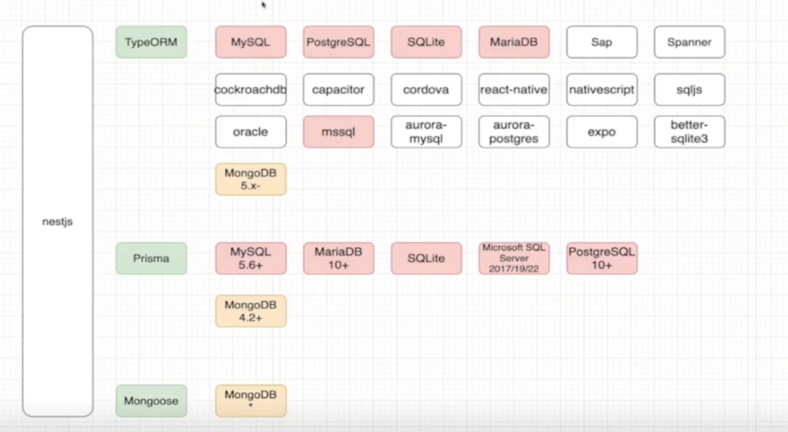
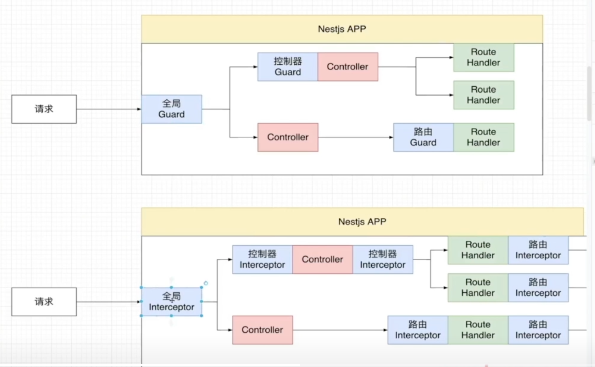
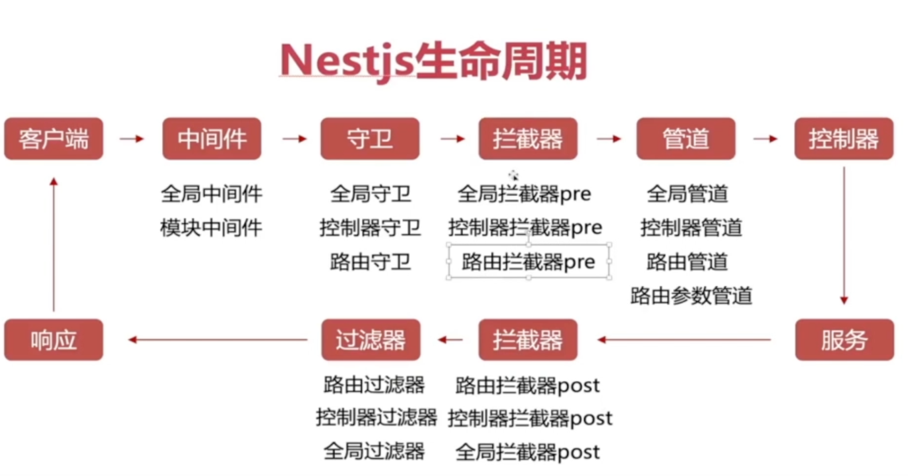
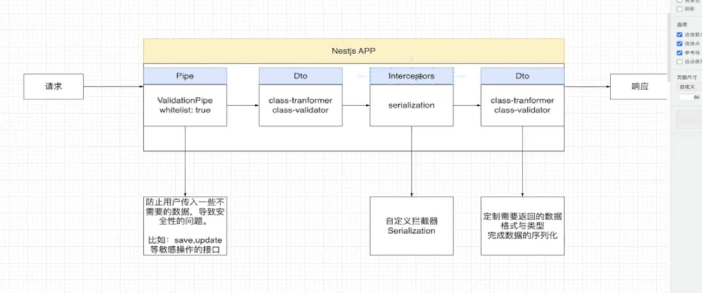

```

1.error:nestjs/typeorm/dist/common/typeorm.utils.js:123 
const generateString = () => crypto.randomUUID();

    解决办法： 更新nodev20+ 或者 @nestjs/typeorm@10.0.2版本


2.prisma使用版本
    "@prisma/client": "5.12.1",
    "prisma": "5.12.1",
3.数据库驱动区分类型
```


```
4.prisma 配置
    generator client {
        provider = "prisma-client-js"
        output = "./client/mysql"
    }
  npx prisma generate 更新驱动类型生成client
  <!-- 软链接 -->
  pnpm add prisma-mysql@link:./prisma/clients/mysql
```
5.管道、拦截器、守卫
                    
                    
                    